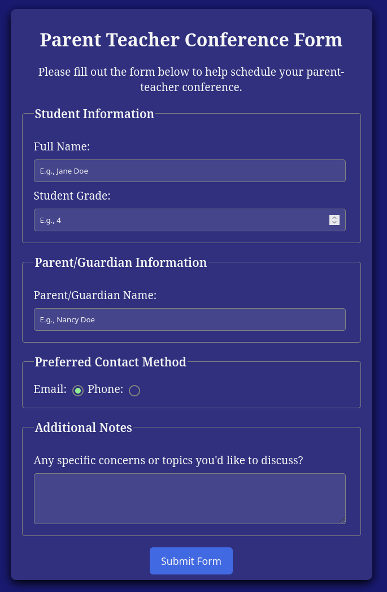

# Formulaire de rencontre parents-professeurs 📝

Atelier FCC terminé. Formulaire accessible utilisant la sémantique HTML5 et les pseudo-classes CSS3.

**Fonctionnalités :** Fieldset/Legend, boutons radio personnalisés, états :hover/:active, interface sombre
**Stack :** HTML5 + CSS3 | Jour 7 #100DaysOfCode
**En ligne :** cedricboucard.github.io/fcc-form-parent-teacher/

# screenshot 

